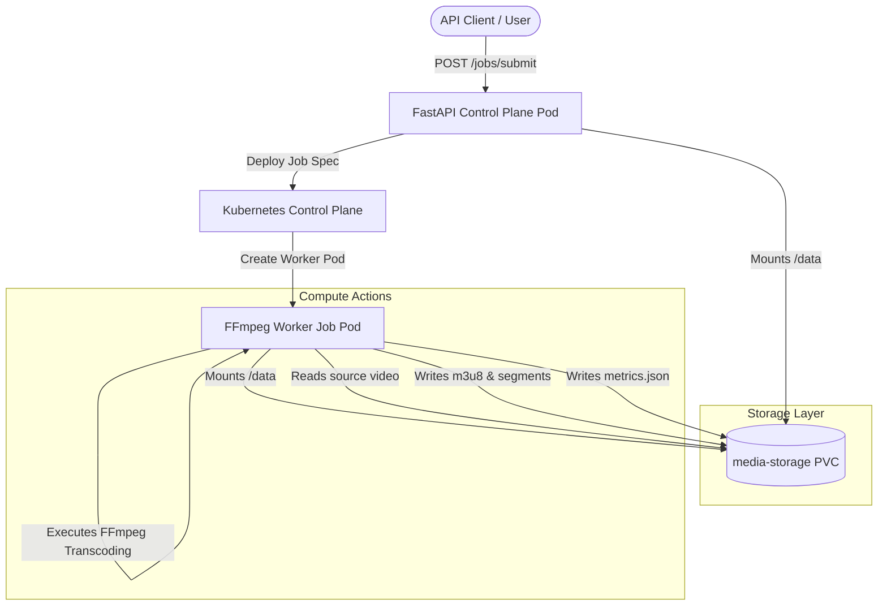
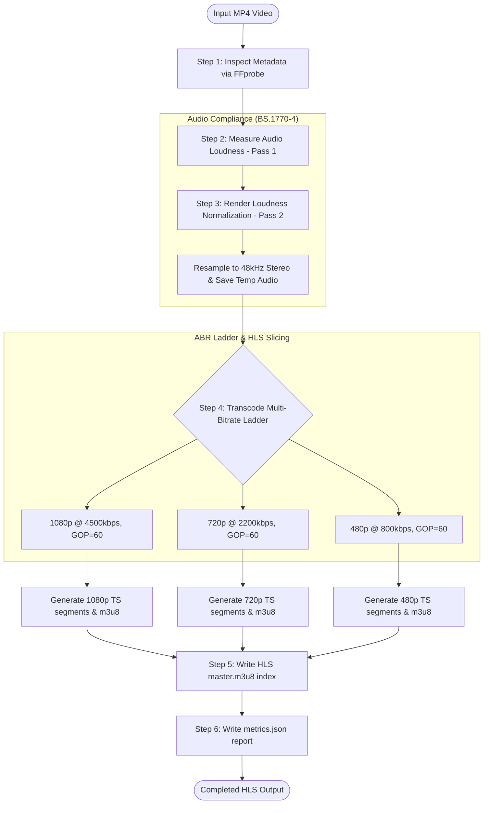
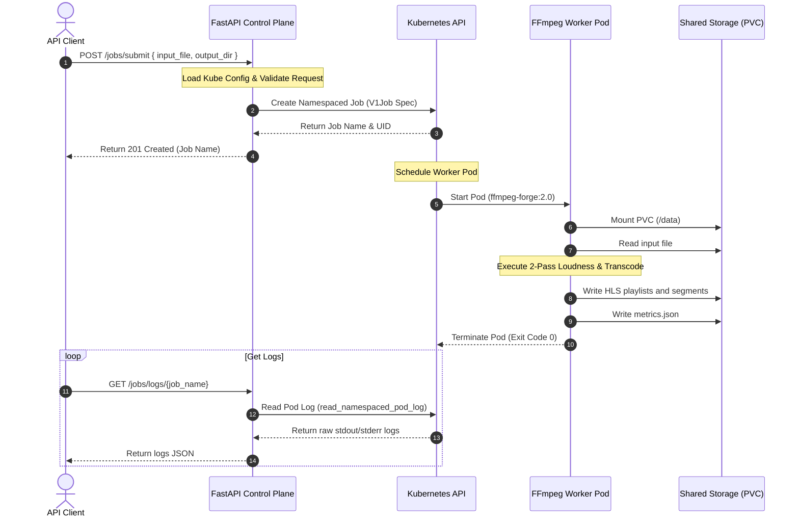

# AI-ForgeStream: Automated Transcoding & Loudness Platform

Welcome to **AI-ForgeStream**! This guide is designed to explain how our media platform works using clear, visual diagrams and step-by-step instructions. Whether you are a Broadcast Operator, a System Architect, or preparing for an engineering interview, this document breaks down the concepts, commands, and structures.

---

## 📂 Project Repository Tree

Below is the directory structure of the project. It shows exactly where every component lives:

```text
AI-ForgeStream
│
├── .agents/                      # AI Customization & Knowledge base (RAG)
│   ├── MEMORY.md                 # Project architecture memory for quick retrieval
│   └── skills/
│       └── ai-forgestream-media/
│           └── SKILL.md          # Special media instructions for LLMs
│
├── src/                          # Application Source Code
│   ├── api/
│   │   └── main.py               # FastAPI orchestrator control plane
│   └── worker/
│       └── processor.py          # Python FFmpeg transcode & loudness worker
│
├── k8s/                          # Kubernetes Manifests
│   ├── namespace.yaml            # Isolated K8s namespace (ai-forgestream)
│   ├── media-pvc.yaml            # Shared persistent volume claim (media-storage)
│   ├── rbac.yaml                 # ServiceAccount, Roles, and Bindings
│   ├── api-deployment.yaml       # FastAPI deployment spec
│   ├── api-service.yaml          # LoadBalancer ingress service
│   ├── ffmpeg-configmap.yaml     # ConfigMap for media settings
│   ├── ffmpeg-version-job.yaml   # Validation job
│   └── ffmpeg-real-job.yaml      # Real transcode job spec
│
├── terraform/                    # Infrastructure as Code (IaC)
│   └── main.tf                   # Declares Namespace, PVC, RBAC, and ConfigMaps
│
├── docker/
│   └── Dockerfile                # Multi-role Alpine-Python image (with FFmpeg)
│
├── samples/
│   └── input.mp4                 # Source test video
│
└── outputs/
    └── hls_test/                 # Processed HLS output folders (1080p, 720p, 480p)
```

---

## 📖 Quick-Reference: Key Media Concepts

If you are asked about media processing in an interview, here is how you explain them in plain English:

### 1. What is Loudness Normalization (ITU-R BS.1770-4 / EBU R128)?
*   **The Problem**: Different video files have different sound levels. If a player transitions from a quiet movie to a loud commercial, it hurts the viewer's ears.
*   **The Solution**: We don't just "turn up the volume" (peak normalization) because a single loud noise (like a gunshot) would make the rest of the file too quiet. Instead, we measure the *average perceived volume* over the entire file (Loudness Units Full Scale, or **LUFS**).
*   **The Dolby Target**: Standard broadcast target is `-24.0 LUFS`. We also limit the maximum "True Peak" to `-2.0 dBTP` to prevent digital sound distortion.

### 2. What is Adaptive Bitrate Streaming (ABR) & HLS?
*   **The Problem**: A viewer might start watching on high-speed home Wi-Fi, then walk outside and drop to a weak 3G cellular signal. If we only stream one giant 1080p file, the video will freeze and buffer.
*   **The Solution**: We transcode the source video into three different sizes (1080p, 720p, 480p) and slice each size into tiny **6-second clips** (segments). The video player automatically detects the user's internet speed and switches sizes on the fly.
*   **Master Playlist (`master.m3u8`)**: The "index card" that tells the player where to find the playlists for 1080p, 720p, and 480p.

### 3. What is GOP (Group of Pictures) & Keyframe Alignment?
*   **The Problem**: Sliced HLS segments MUST start with a full, self-contained picture (called a Keyframe or I-frame). If a player switches from 1080p to 720p, but the 720p segment doesn't start at the exact same millisecond as the 1080p segment, the player will stutter or freeze.
*   **The Solution**: We lock the keyframe interval (GOP size) to exactly **60 frames** (which is 2 seconds at 30fps) and disable scene change keyframe insertion (`-sc_threshold 0`). This ensures all resolutions cut their segments at the exact same frames, allowing seamless, silent quality switching!

---

## 🎨 Visual System Architecture & Process Flows

### Diagram 1: High-Level Platform Topology (Block Diagram)
This diagram shows how the user interacts with the FastAPI Control Plane, which orchestrates transcode jobs in the Kubernetes cluster using shared storage.



---

### Diagram 2: Step-by-Step Media Transcoding Pipeline (Flowchart)
This diagram illustrates what happens inside the worker pod when a video is processed. It details the exact transition from raw input MP4 to the ABR HLS output.



---

### Diagram 3: API Orchestration Sequence (Sequence Diagram)
This diagram traces a single transcoding request from the initial API post to the final telemetry logging.



---

## 🛠️ Operational Command Manual
# AI-ForgeStream

AI-ForgeStream is a Kubernetes-native media processing platform built using Terraform, Kubernetes, FFmpeg, and AWS-ready architecture principles.

The project demonstrates Infrastructure as Code (IaC), Persistent Storage Management, RBAC, Kubernetes Jobs, and Media Processing Pipelines.

---

# Architecture

```text
User
 │
 ▼
Input Video
 │
 ▼
Persistent Volume Claim (PVC)
 │
 ▼
Kubernetes Job (FFmpeg)
 │
 ├── Extract Audio
 ├── Normalize Audio
 └── Create Enhanced Video
 │
 ▼
Output Media
 │
 ▼
Persistent Volume Claim (PVC)
```

---

# Technology Stack

* Terraform
* Kubernetes
* Rancher Desktop
* FFmpeg
* Persistent Volumes
* RBAC
* Service Accounts
* ConfigMaps
* Docker

---

# Project Structure

```text
AI-ForgeStream
│
├── terraform
│   ├── provider.tf
│   ├── namespace.tf
│   ├── configmap.tf
│   ├── pvc.tf
│   ├── rbac.tf
│   ├── outputs.tf
│   └── terraform.tfstate
│
├── k8s
│   ├── debug-pvc-pod.yaml
│   └── ffmpeg-process-input-job.yaml
│
├── samples
│   └── input.mp4
│
├── outputs
│   └── terraform-enhanced.mp4
│
└── README.md
```

---

# Phase 1 - Environment Setup

## Verify Kubernetes

```bash
kubectl cluster-info
```

Expected:

```bash
Kubernetes control plane is running
```

---

## Verify Terraform

```bash
terraform version
```

Expected:

```bash
Terraform v1.x.x
```

---

## Verify Storage Class

```bash
kubectl get storageclass
```

Expected:

```bash
standard (default)
```

---

# Phase 2 - Terraform Infrastructure

## Initialize Terraform

```bash
terraform init
```

Expected:

```bash
Terraform has been successfully initialized
```

---

## Validate Configuration

```bash
terraform validate
```

Expected:

```bash
Success! The configuration is valid.
```

---

## Review Plan

```bash
terraform plan
```

---

## Deploy Infrastructure

```bash
terraform apply
```

---

# Resources Created

## Namespace

```text
ai-forgestream
```

---

## ConfigMap

```text
ffmpeg-config
```

Contains:

```text
VIDEO_CODEC=libx264
AUDIO_CODEC=aac
VIDEO_BITRATE=2000k
AUDIO_BITRATE=128k
```

---

## Persistent Volume Claim

```text
media-storage
```

Size:

```text
1Gi
```

---

## Service Account

```text
ai-forgestream-api-sa
```

---

## Role

```text
job-manager-role
```

Permissions:

```text
Jobs
Pods
Pod Logs
```

---

## Role Binding

```text
job-manager-role-binding
```

---

# Verify Infrastructure

## Namespace

```bash
kubectl get ns ai-forgestream
```

---

## ConfigMap

```bash
kubectl get configmap -n ai-forgestream
```

---

## PVC

```bash
kubectl get pvc -n ai-forgestream
```

Expected:

```bash
STATUS: Bound
```

---

## Service Account

```bash
kubectl get sa -n ai-forgestream
```

---

## Role

```bash
kubectl get role -n ai-forgestream
```

---

## Role Binding

```bash
kubectl get rolebinding -n ai-forgestream
```

---

# Phase 3 - Terraform State Management

## Import Existing Resources

Namespace

```bash
terraform import kubernetes_namespace.ai_forgestream ai-forgestream
```

ConfigMap

```bash
terraform import kubernetes_config_map.ffmpeg_config ai-forgestream/ffmpeg-config
```

PVC

```bash
terraform import kubernetes_persistent_volume_claim.media_storage ai-forgestream/media-storage
```

---

## View State

```bash
terraform state list
```

Expected:

```text
kubernetes_namespace.ai_forgestream
kubernetes_config_map.ffmpeg_config
kubernetes_persistent_volume_claim.media_storage
kubernetes_role.job_manager_role
kubernetes_role_binding.job_manager_binding
kubernetes_service_account.api_sa
```

---

## Refresh State

```bash
terraform apply -refresh-only
```

Expected:

```bash
No changes.
```

---

# Phase 4 - Media Processing Pipeline

## Create Debug Pod

```bash
kubectl apply -f k8s/debug-pvc-pod.yaml
```

Verify:

```bash
kubectl get pods -n ai-forgestream
```

Expected:

```text
debug-pvc Running
```

---

## Copy Input Video

```bash
kubectl cp samples/input.mp4 ai-forgestream/debug-pvc:/data/input.mp4
```

---

## Verify File

```bash
kubectl exec -it debug-pvc -n ai-forgestream -- ls -lh /data
```

Expected:

```text
input.mp4
```

---

## Run FFmpeg Job

```bash
kubectl apply -f k8s/ffmpeg-process-input-job.yaml
```

---

## Monitor Job

```bash
kubectl get jobs -n ai-forgestream
```

Expected:

```text
ffmpeg-process-input Complete
```

---

## View Job Pod

```bash
kubectl get pods -n ai-forgestream
```

Example:

```text
ffmpeg-process-input-xxxxx
```

---

## View Logs

```bash
kubectl logs ffmpeg-process-input-xxxxx -n ai-forgestream
```

Expected:

```text
Step 1: Extract Audio
Step 2: Normalize Audio
Step 3: Create Enhanced Video
Processing Completed
```

---

# Verify Generated Files

Connect to Debug Pod:

```bash
kubectl exec -it debug-pvc -n ai-forgestream -- sh
```

List files:

```bash
ls -lh /data
```

Expected:

```text
input.mp4
audio.wav
normalized.wav
enhanced.mp4
```

---

# Download Processed Video

```bash
kubectl cp ai-forgestream/debug-pvc:/data/enhanced.mp4 outputs/terraform-enhanced.mp4
```

Expected:

```text
outputs/terraform-enhanced.mp4
```

---

# Destroy and Rebuild Test

Delete Namespace:

```bash
kubectl delete namespace ai-forgestream
```

Terraform detects drift:

```bash
terraform plan
```

Expected:

```text
6 to add
```

Recreate:

```bash
terraform apply
```

Expected:

```text
Apply complete!
```

---

# Current Terraform Outputs

```bash
terraform output
```

Example:

```text
namespace = "ai-forgestream"
pvc_name = "media-storage"
service_account = "ai-forgestream-api-sa"
role_name = "job-manager-role"
```

---

# Terraform Managed Workloads
The objective is to manage Pods and Jobs directly through Terraform rather than manually applying Kubernetes manifests.

```FFmpeg Job```

Purpose:

Execute media processing
Consume input media
Produce enhanced output

```Terraform Resource:```

resource "kubernetes_job" "ffmpeg_process"
Import Existing Workloads

If workloads were initially created using kubectl, Terraform can adopt them.

Import Debug Pod:

```terraform import kubernetes_pod.debug_pvc ai-forgestream/debug-pvc```

Import FFmpeg Job:

```terraform import kubernetes_job.ffmpeg_process ai-forgestream/ffmpeg-process-input```
Verify Terraform State

List resources:

```terraform state list```

Expected:

```kubernetes_namespace.ai_forgestream
kubernetes_config_map.ffmpeg_config
kubernetes_persistent_volume_claim.media_storage
kubernetes_service_account.api_sa
kubernetes_role.job_manager_role
kubernetes_role_binding.job_manager_binding
kubernetes_pod.debug_pvc
kubernetes_job.ffmpeg_process```

Drift Detection

Terraform continuously compares actual cluster resources with the declared configuration.

Run:

```terraform plan```

Example output:

Terraform detected changes outside Terraform

This confirms drift detection is functioning correctly.

Terraform Reconciliation Test

Modify workload definitions.

Run:

```terraform apply```

Terraform will:

Destroy old workload
Create new workload

Example:

Plan: 2 to add, 2 to destroy

Result:

kubernetes_pod.debug_pvc
kubernetes_job.ffmpeg_process

are recreated automatically.

Validate Workload Recreation

Verify Pod:

```kubectl get pods -n ai-forgestream```

Expected:

debug-pvc Running

Verify Job:

kubectl get jobs -n ai-forgestream

Expected:

ffmpeg-process-input Complete
Infrastructure Coverage

Terraform now manages:

Platform Layer
Namespace
ConfigMap
PVC
RBAC
Service Accounts
Workload Layer
Debug Pod
FFmpeg Job

---

# Current Project Status

## Completed

* Phase 1 Environment Setup
* Phase 2 Terraform Infrastructure
* Phase 3 State Management
* Phase 4 FFmpeg Media Processing

## Upcoming

* Phase 4.5 Terraform Managed Workloads
* Phase 5 FastAPI Service
* Phase 6 Kubernetes API Integration
* Phase 7 AWS EKS Deployment
* Phase 8 Production CI/CD
* Phase 9 Observability
* Phase 10 AI Pipeline Integration

---

# Author

Vikash Jaiswal

AWS | Terraform | Kubernetes | DevOps | Platform Engineering | AI Infrastructure


### Phase 1: Local Terminal Commands
These are the manual commands you ran on your machine to process the test video (as documented in `Commands.sh`):

#### 1. Inspect the media
Check codecs, stream indices, and layouts:
```bash
ffprobe samples/input.mp4
```

#### 2. Extract the raw audio track
```bash
ffmpeg -i samples/input.mp4 outputs/audio.wav
```

#### 3. Level the Audio (EBU R128 Loudnorm)
```bash
ffmpeg -i outputs/audio.wav -af loudnorm outputs/normalized.wav
```

#### 4. Merge (Mux) the leveled audio back with the original video
```bash
ffmpeg -i samples/input.mp4 -i outputs/normalized.wav -c:v copy -map 0:v:0 -map 1:a:0 outputs/enhanced.mp4
```

---

### Phase 2: Docker Containers

#### 1. Build the unified Docker Image
Build the container image tagged as `ffmpeg-forge:2.0`:
```bash
docker build -t ffmpeg-forge:2.0 -f docker/Dockerfile .
```

#### 2. Run the container and mount your project folder
Run the container, linking your current directory (`$(pwd)`) to the container's workspace `/workspace`:
```bash
docker run -it -v $(pwd):/workspace ffmpeg-forge:2.0
```

---

### Phase 3: Infrastructure Provisioning (Terraform IaC)
## Phase 3 Completed

### Kubernetes Batch Media Processing

Features:

- Kubernetes Namespace
- ConfigMap Configuration Management
- Persistent Volume Claims (PVC)
- Shared Storage Validation
- FFmpeg Batch Processing Jobs
- Kubernetes Native Media Workflows

Validated Outputs:

- enhanced.mp4
- docker_enhanced.mp4
- k8s-enhanced.mp4

Platform Stack:

FFmpeg → Docker → Kubernetes

Rather than applying Kubernetes configurations manually, you can use **Terraform** to deploy the infrastructure components as code:

#### 1. Initialize Terraform Providers
Installs the Kubernetes providers:
```bash
cd terraform
terraform init
```

#### 2. Provision Resources
Deploys the namespace, PersistentVolumeClaim, ServiceAccount, RBAC Roles, and ConfigMaps:
```bash
terraform apply -auto-approve
cd ..
```

---

### Phase 4: Running the Python Worker Script (Manual Run)

You can run the Python transcode pipeline worker directly on your terminal to process a file and generate HLS segments:

```bash
python3 src/worker/processor.py \
  --input samples/input.mp4 \
  --output-dir outputs/hls_test \
  --target-lufs -24.0
```
This script runs the 2-pass loudness normalization, creates the HLS segments, writes the master index, and creates a JSON quality report `metrics.json`.

---

### Phase 5: Kubernetes Manual Deployments
If you choose not to use Terraform, you can deploy the configurations manually:

#### 1. Apply Namespace
```bash
kubectl apply -f k8s/namespace.yaml
```

#### 2. Apply Storage Claim
```bash
kubectl apply -f k8s/media-pvc.yaml
```

#### 3. Apply RBAC Permissions
```bash
kubectl apply -f k8s/rbac.yaml
```

#### 4. Deploy Control Plane API
```bash
kubectl apply -f k8s/api-deployment.yaml
kubectl apply -f k8s/api-service.yaml
```

Check deployment status:
```bash
kubectl get all -n ai-forgestream
```

---

### Phase 6: Interacting with the API Gateway

Once the API Gateway is deployed (running on `http://localhost:8000`), use the following endpoints:

#### 1. Submit a Job
Submits a media asset to be processed. The API gateway generates a Kubernetes Batch Job dynamically.
```bash
curl -X POST http://localhost:8000/jobs/submit \
  -H "Content-Type: application/json" \
  -d '{"input_file": "input.mp4", "output_dir": "hls_test", "target_lufs": -24.0}'
```

#### 2. Query Job Status
```bash
curl http://localhost:8000/jobs/status/transcode-job-<ID>
```

#### 3. Fetch Worker Logs
```bash
curl http://localhost:8000/jobs/logs/transcode-job-<ID>
```
